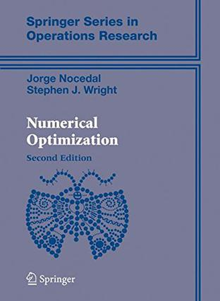

# optimization

One day I meet a book, then there is a way I can study.

One day I can study, then there are many problem need to be solved.

One day there are many problem need to be solved, then there are many codes and formulas need to be saved.

One day there are many codes and formulas, then there is a project on github.

This repository contains exercises and codes in this [book](https://link.springer.com/book/10.1007/978-0-387-40065-5).

[cg](5Conjugate Gradient Methods/cg.md)

[homework4](./homework/homework 4.md)

