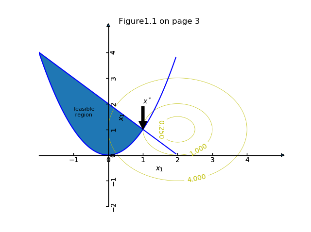

$$
\min (x_1-2)^2+(x_2-1)^2\\
s.t. \quad x_1^2-x_2\leq 0\\
\quad\quad\quad x_1+x_2\leq2
$$

```python
import matplotlib
import numpy as np
import matplotlib.pyplot as plt
from mpl_toolkits.axisartist.axislines import SubplotZero

fig = plt.figure(1)
ax = SubplotZero(fig, 111)
fig.add_subplot(ax)

for direction in ["xzero", "yzero"]:
    # adds arrows at the ends of each axis
    ax.axis[direction].set_axisline_style("-|>")

    # adds X and Y-axis from the origin
    ax.axis[direction].set_visible(True)

for direction in ["left", "right", "bottom", "top"]:
    # hides borders
    ax.axis[direction].set_visible(False)

ax.set_title('Figure1.1 on page 3')
ax.set_xlabel(r'$x_1$')
ax.set_ylabel(r'$x_2$')


# draw contours
matplotlib.rcParams['xtick.direction'] = 'out'
matplotlib.rcParams['ytick.direction'] = 'out'

delta = 0.05
x1 = np.arange(-2.0, 5.0, delta)
x2 = np.arange(-2.0, 5.0, delta)
X1, X2 = np.meshgrid(x1, x2)
Z = (X1 - 2) ** 2 + (X2 - 1) ** 2
levels = [0.25, 1, 4]
CS = ax.contour(X1, X2, Z, levels, colors='y', linewidths=0.5)
ax.clabel(CS, inline=1, fontsize=10)


# draw c1 x_1^2-x^2 <= 0
c1x1 = np.arange(-2.0, 2.0, delta)
c1x2 = c1x1 ** 2
ax.plot(c1x1, c1x2, 'b')

# draw c1 x_1+x^2 <= 2
c2x1 = np.arange(-2.0, 2.0, delta)
c2x2 = 2 - c2x1
ax.plot(c2x1, c2x2, 'b')

# fill the feasible region
ax.fill_between(c1x1, c1x2, c2x2, where=c2x2 >= c1x2, interpolate=True)

# draw text and annotate
ax.annotate('$x^*$', xy=(1, 1), xytext=(1, 2),
            arrowprops=dict(facecolor='black', shrink=1))
ax.text(-1, 1.5, 'feasible\n region', fontsize=8)

plt.show()
```

